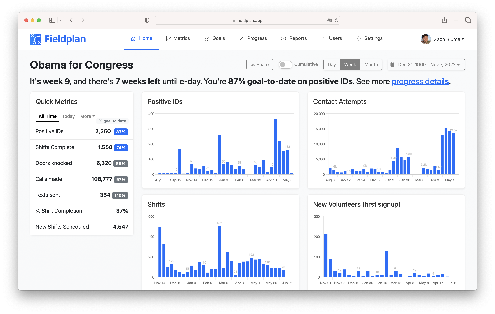

# Field Plan: Voter Contact Metrics for Your Campaign

<b>Live demo: https://fieldplan.app</b>

A dashboard for organizers and campaign managers to see progress-to-goal on their field program.

No more spreadsheets, no more exporting, no more nightly manual reports.

100% self service, 5 minutes to setup, stays forever in sync.

**Features:**

- Automatically sync every 15 minutes with NGPVAN.
- Configure a simple ramp and show your progress to goal, based on industry standard research.
- Benchmark your field metrics against anonymized ramps and production metrics from other past campaigns.
- See voter-contact metrics AND your volunteer-organizing metrics.
- Send nightly 9pm field reports to yourself and your team via email, slack, and text.

**Instantly get answers on one page to questions like:**

- How many voters have we positive ID'd as voting for us?
- How many total phone calls and door knocks have we ever made?
- This week, how many volunteers signed up for a new shift?
- Whats our average week-over-week growth in shifts been?
- How many positive IDs are we generating per newly scheduled shift on average?
