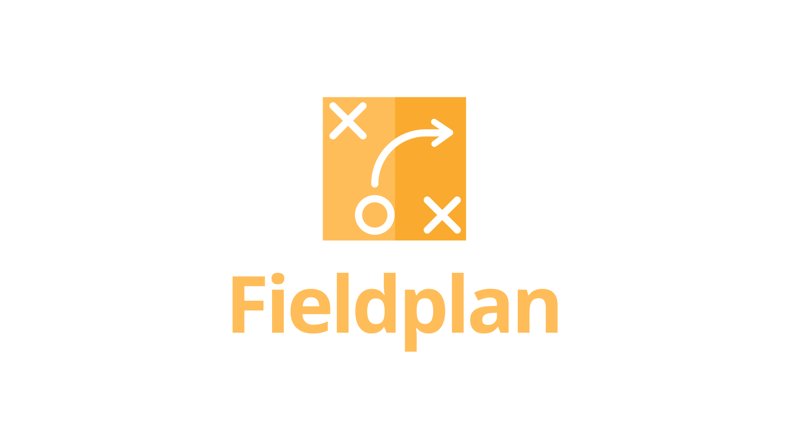
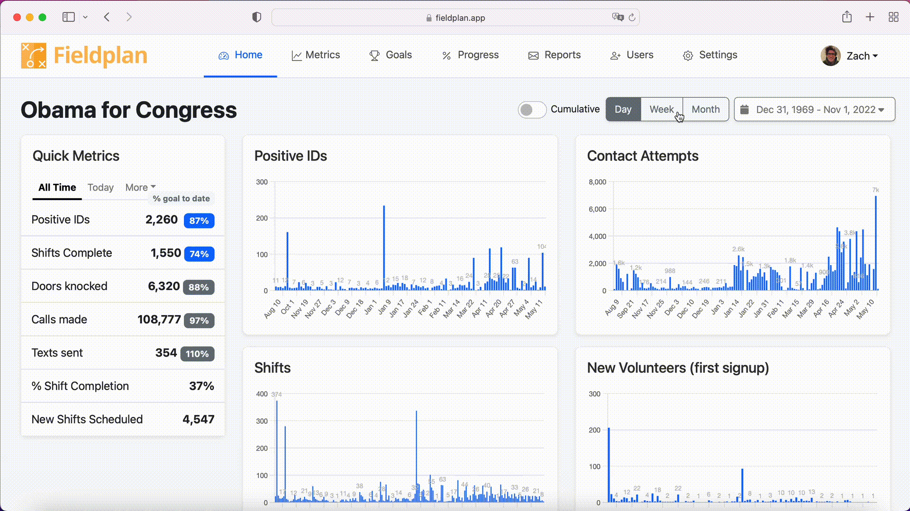

# We love a GIF!

# Field Plan.app

Live demo: https://fieldplan.app

A dashboard for field directors, campaign managers, and field organizers to see progress to goal on their field program.

- Why spend hours per week exporting data manually, filling out reports, and making metrics -- all of it is stored in a database!
- Why spend valuable data staffer time on such a simple, unchanging problem?
- Why spend 3 weeks setting up a SQL mirror, then coding from scratch the same metrics everyone else uses, and then wait hours to update, periodically experiencing downtime?

Field Plan: 100% self service, 5 minutes to setup, stays forever in sync. Get metrics standardized across campaigns, giving you confidence you are looking at meaningful insights.

**Features:**

- Automatically sync every 15 minutes with NGPVAN.
- Configure a simple ramp and show your progress to goal, based on industry standard research.
- Benchmark your field metrics against anonymized ramps and production metrics from other past campaigns.
- See voter-contact metrics AND your volunteer-organizing metrics.
- Send nightly 9pm field reports to yourself and your team via email, slack, and text.

**Instantly get answers on one page to questions like:**

- How many voters have we positive ID'd as voting for us?
- How many total phone calls and door knocks have we ever made?
- This week, how many volunteers signed up for a new shift?
- Whats our average week-over-week growth in shifts been?
- How many positive IDs are we generating per newly scheduled shift on average?
